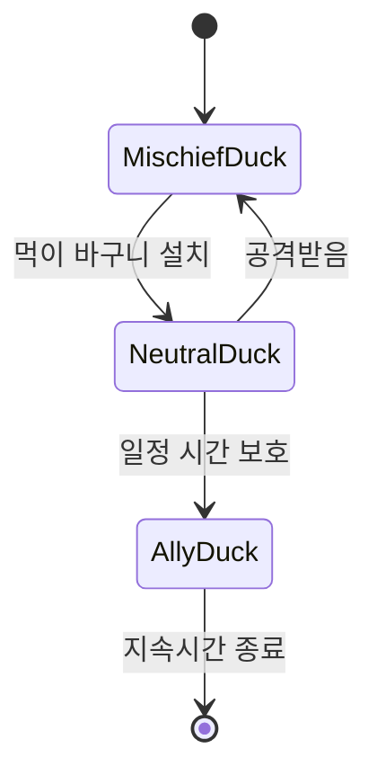
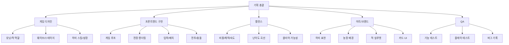

# 하미디펜스 마스터 기획서

작성일: 2026-06-16  
프로젝트 위치: `바탕화면/웹 게임/디펜스게임`  
문서 목적: `하미디펜스`의 컨셉, 디펜스 시스템, 하미 성장 구조, 적/아군 설계, 기술 구현, 프로토타입 단계, 향후 확장 방향을 하나의 기준 문서로 정리한다.

---

## 0. 문서 정리 기준

현재 프로젝트에는 아래 두 문서가 있다.

| 파일 | 역할 | 유지 필요성 |
|---|---|---|
| `docs/01_pvz_analysis_and_farmers_vs_insects_concept.md` | 원작 구조 분석, 초기 컨셉 기록 | 참고/히스토리용 |
| `프로토타입_기술기획_대시보드.md` | 기술 병목, 구현 단계, MVP 계획 | 참고/기술 계획용 |
| `인생쌀집_하미_디펜스_마스터기획서.md` | `하미디펜스` 최종 기준 문서 | 앞으로 메인으로 사용 |

두 기존 문서는 완전히 필요 없는 것은 아니지만, 실제 작업 기준으로 계속 둘 다 열어볼 필요는 없다. 앞으로는 이 문서를 중심으로 개발하고, 기존 문서는 의사결정 히스토리로 남기는 것이 좋다.

---

## 1. 게임 한 줄 정의

`인생쌀집`의 쌀알 마스코트 `하미`가 논밭과 쌀 창고를 지키고, 해충과 고라니, 멧돼지, 새, 말썽 동물들을 막아내는 웹 기반 브랜드 라인 디펜스 게임.

---

## 2. 핵심 방향

이 게임은 `Plants vs. Zombies`의 라인 디펜스 구조를 오마주하지만, 캐릭터, 세계관, 배경, 적, UI, 보상 구조는 완전히 `인생쌀집`과 `하미` 중심으로 새로 만든다.

### 가져올 구조

- 가로형 라인 디펜스
- 칸 단위 배치
- 자원 생산
- 카드 선택
- 적 웨이브
- 유닛별 역할 차이
- 특수 적에 대한 카운터
- 초반 여유, 후반 압박 구조

### 그대로 가져오면 안 되는 요소

- 원작 식물 캐릭터의 외형, 이름, 표정
- 좀비 콘셉트와 복장
- 잔디밭/수영장/지붕 스테이지의 직접 복제
- 원작 카드 UI 배치와 비주얼 느낌
- 원작 사운드, 폰트, 레벨명, 말투

### 우리 게임의 차별점

- 주인공은 식물이나 농부가 아니라 `하미`
- 방어 유닛은 `농장 장치`, `쌀/작물 친구`, `농기구`, `논밭 도구`
- 적은 곤충에서 시작해 고라니, 멧돼지, 까치, 오리 같은 농장 침입자로 확장
- 오리처럼 일부 적은 조건에 따라 아군으로 전향 가능
- 하미 성장, 운동, 응원 이미지를 스킬/보상/레벨업과 연결

---

## 3. 하미 캐릭터 분석

사용자가 제공한 이미지 기준으로 하미는 다음 인상을 가진다.

| 요소 | 관찰 |
|---|---|
| 기본 실루엣 | 쌀알, 씨앗, 달걀처럼 둥글고 흰 캐릭터 |
| 얼굴 | 작은 검은 눈, 웃는 입, 분홍 볼터치 |
| 몸 | 짧고 통통한 팔과 다리 |
| 질감 | 말랑한 3D 피규어 느낌 |
| 앱 내 역할 | 말풍선으로 반응하는 안내자/마스코트 |
| 확장 이미지 | 덤벨, 바벨, 운동기구를 쓰는 성장형 캐릭터 |
| 성장 이미지 | 껍질이 열리며 1~4단계로 성장하는 구조 |

### 게임 내 하미 역할

하미는 계속 전장에 배치되는 일반 유닛이 아니라, 게임 전체의 주인공이자 지휘자 역할이 좋다.

| 역할 | 설명 |
|---|---|
| 메인 마스코트 | 타이틀, HUD, 결과 화면에 등장 |
| 튜토리얼 가이드 | 초반 조작법을 말풍선으로 안내 |
| 농장 지휘자 | 플레이어가 배치하는 유닛들을 응원 |
| 스킬 발동자 | 게이지가 차면 특수 능력 사용 |
| 성장 주인공 | 스테이지 클리어/보상으로 성장 단계 상승 |

### 하미 말투 방향

하미는 귀엽지만 너무 유아적으로 가지 않는 것이 좋다. 인생쌀집 브랜드 게임이므로 따뜻하고 밝은 톤을 유지한다.

예시:

- `밥심으로 막아보자!`
- `저기 벌레가 와요!`
- `쌀 창고는 내가 지킬게요!`
- `고라니가 뛰어넘으려고 해요!`
- `오리는 달래면 우리 편이 될지도 몰라요!`
- `운동한 보람이 있어요!`

---

## 4. 세계관

인생쌀집 농장에는 하미와 작물 친구들이 살고 있다. 어느 날 이상기후와 먹이 부족으로 해충과 야생동물들이 농장으로 몰려오기 시작한다. 처음에는 작은 벌레들이 벼와 작물을 갉아먹지만, 시간이 지나며 고라니가 밭을 뛰어넘고, 멧돼지가 방벽을 들이받고, 까치와 까마귀가 쌀알을 훔쳐간다.

하미는 농장 장치와 작물 친구들을 지휘해 인생쌀집의 논밭, 과수원, 쌀 창고를 지켜야 한다.

### 세계관 키워드

- 쌀
- 밥심
- 논밭
- 수확
- 농장 지키기
- 귀여운 위기
- 해충 방어
- 말썽 동물
- 성장하는 하미

---

## 5. 게임 플레이 핵심 루프

1. 스테이지 시작
2. 하미가 짧은 상황 설명
3. 플레이어가 카드 유닛 선택
4. 자원을 모아 격자 칸에 방어 유닛 배치
5. 오른쪽에서 적 등장
6. 방어 유닛이 자동 공격
7. 적이 방어물을 공격하거나 우회
8. 위기 때 하미 스킬 사용
9. 모든 웨이브를 막으면 승리
10. 보상 획득, 하미 성장 또는 새 카드 해금

---

## 6. 기본 화면 구조

### 전장

- 5개 라인
- 9개 열
- 왼쪽은 하미 농장/쌀 창고 보호 구역
- 오른쪽에서 적 등장
- 각 칸에는 방어 유닛 1개 배치
- 적은 기본적으로 같은 라인에서 왼쪽으로 이동

### UI 배치

| 영역 | 내용 |
|---|---|
| 상단 왼쪽 | 하미 얼굴, 자원, 스킬 게이지 |
| 상단 중앙 | 방어 유닛 카드 |
| 상단 오른쪽 | 일시정지, 속도, 설정 |
| 중앙 | 5x9 전장 |
| 왼쪽 끝 | 농장/쌀 창고 방어선 |
| 하단 | 하미 말풍선, 웨이브 진행도, 도움말 |

### 시각적 목표

- 원작의 잔디밭 느낌을 피한다.
- 논밭, 흙길, 밭고랑, 쌀 창고, 과수원 느낌을 강조한다.
- 하미와 유닛은 둥글고 귀엽게, 적은 장난스럽지만 위협적으로 표현한다.
- 적 실루엣은 크기와 모양이 확실히 달라야 한다.

---

## 7. 자원 시스템

### 자원 이름 후보

| 후보 | 장점 |
|---|---|
| 쌀알 | 브랜드와 가장 직접 연결 |
| 밥심 | 하미 말투와 잘 맞음 |
| 햇살쌀 | 원작 자원 느낌을 피하면서 밝음 |
| 수확량 | 농장 시뮬레이션 느낌 |

추천: `쌀알`

### 자원 규칙

- 기본적으로 시간이 지나며 조금씩 생성된다.
- 생산형 유닛을 배치하면 추가 생성된다.
- 유닛 배치에 자원이 든다.
- 하미 스킬 일부는 자원 생산을 일시 강화한다.

### 초기 수치 예시

| 항목 | 수치 |
|---|---|
| 시작 자원 | 75 |
| 기본 자동 생산 | 5초마다 25 |
| 퇴비통 생산 | 7초마다 25 |
| 기본 공격 유닛 비용 | 100 |
| 방벽 비용 | 50 |
| 즉발 폭죽 비용 | 150 |

---

## 8. 방어 유닛 설계

### MVP 방어 유닛 5종

| 이름 | 역할 | 비용 | 체력 | 핵심 기능 |
|---|---|---:|---:|---|
| 퇴비통 | 생산 | 50 | 120 | 일정 시간마다 쌀알 생성 |
| 새총 허수아비 | 기본 공격 | 100 | 100 | 같은 라인에 돌멩이/쌀알탄 발사 |
| 호박 방벽 | 방어 | 50 | 400 | 적을 막고 시간을 벌어줌 |
| 끈끈이 판 | 감속 | 75 | 80 | 밟은 적 이동속도 감소 |
| 고추 폭죽 | 즉발 | 150 | 1 | 한 라인에 즉시 큰 피해 |

### 확장 방어 유닛 후보

| 이름 | 역할 | 설명 |
|---|---|---|
| 벌레잡이 램프 | 대공 | 나방, 말벌, 참새 같은 공중 적 공격 |
| 바람개비 | 밀치기 | 가벼운 적을 뒤로 밀어냄 |
| 물대포 | 라인 공격 | 논 스테이지에서 강화 |
| 쌀포대 벽 | 고급 방벽 | 멧돼지 돌진을 한 번 막음 |
| 먹이 바구니 | 전향 | 오리를 중립/아군으로 바꿈 |
| 땅울림 덫 | 대지하 | 두더지를 지상으로 끌어냄 |
| 참새 둥지 | 대공 보조 | 공중 적을 쫓아냄 |
| 농기구 투척대 | 고화력 | 느리지만 강한 피해 |

---

## 9. 적군 설계

적군은 4개 계층으로 나눈다.

1. 해충
2. 농장 침입 동물
3. 공중 약탈자
4. 개그/전향형 동물

### 9-1. 해충

| 이름 | 역할 | 특징 | 대응 |
|---|---|---|---|
| 진딧물 | 기본 잡몹 | 약하지만 많이 등장 | 기본 공격 |
| 애벌레 | 탱커 | 느리지만 체력 높음 | 지속 화력 |
| 메뚜기 | 고속/점프 | 빠르게 접근, 낮은 방어물 점프 | 감속, 즉발 피해 |
| 풍뎅이 | 장갑 | 단단한 껍질 | 고화력, 방어 관통 |
| 개미떼 | 다수 러시 | 한 라인에 몰려옴 | 광역 공격 |
| 말벌 | 공중 공격 | 특정 유닛 공격 | 대공 유닛 |

### 9-2. 농장 침입 동물

| 이름 | 역할 | 특징 | 대응 |
|---|---|---|---|
| 고라니 | 빠른 침입자 | 낮은 방벽을 뛰어넘음 | 높은 방벽, 감속 |
| 멧돼지 | 돌진 탱커 | 방벽에 큰 피해 | 쌀포대 벽, 폭죽 |
| 두더지 | 우회형 | 땅속으로 이동 | 땅울림 덫 |
| 들쥐 | 소형 떼 | 쌀 창고를 노림 | 광역 공격 |

### 9-3. 공중 약탈자

| 이름 | 역할 | 특징 | 대응 |
|---|---|---|---|
| 참새 | 소형 공중 떼 | 빠르고 작음 | 벌레잡이 램프 |
| 까치 | 후방 교란 | 생산 유닛을 노림 | 대공, 보호막 |
| 까마귀 | 방해꾼 | 자원 훔치기, 카드 방해 | 빠른 대공, 하미 스킬 |
| 직박구리 | 과수원 특화 | 과일/작물 타격 | 과수원 대공 유닛 |
| 기러기 | 대형 공중 | 느리지만 체력 높음 | 고화력 대공 |

### 9-4. 개그/전향형 동물

| 이름 | 처음 상태 | 전환 후 | 특징 |
|---|---|---|---|
| 오리 | 말썽 적 | 해충을 먹는 아군 | 먹이 바구니로 전향 |
| 청설모 | 자원 도둑 | 보상 드랍 | 쌀알을 훔치고 도망 |
| 여우 | 닭장 습격 이벤트 | 없음 | 농작물보다는 이벤트 적 |

---

## 10. 오리 전향 시스템

오리는 이 게임의 대표적인 차별화 기믹으로 쓸 수 있다.

### 컨셉

오리는 처음엔 논을 어지럽히는 말썽꾼이다. 하지만 하미가 먹이를 주거나 진정시키면 해충을 먹는 아군이 된다.

### 상태 변화



### 게임 효과

| 상태 | 행동 |
|---|---|
| 말썽 오리 | 물길을 따라 이동하며 배치를 방해 |
| 중립 오리 | 잠시 멈추고 주변을 살핌 |
| 아군 오리 | 해충을 먹거나 적을 느리게 만듦 |

---

## 11. 하미 스킬

하미 스킬은 플레이어가 위기 때 직접 누르는 액티브 스킬이다.

### MVP 스킬 1종

| 이름 | 효과 | 연출 |
|---|---|---|
| 하미 응원 | 10초 동안 쌀알 생산량 증가 | 하미가 팔을 들고 응원 |

### 확장 스킬

| 이름 | 효과 | 사용 상황 |
|---|---|---|
| 바벨 내려치기 | 선택한 칸 주변 큰 피해 | 멧돼지/고라니 대응 |
| 횃불 휘두르기 | 한 줄 적을 뒤로 밀고 지속 피해 | 몰려오는 해충 대응 |
| 쌀알 보호막 | 한 줄 방어 유닛 보호막 | 방벽 붕괴 직전 |
| 껍질 각성 | 모든 아군 공격속도 증가 | 마지막 웨이브 |
| 오리 달래기 | 오리를 중립 상태로 변경 | 논 스테이지 |

---

## 12. 스테이지 설계

### 스테이지 월드

| 월드 | 배경 | 주요 적 | 핵심 규칙 |
|---|---|---|---|
| 1. 밭 | 기본 흙밭 | 진딧물, 애벌레, 메뚜기 | 기본 배치/공격 학습 |
| 2. 논 | 물길 있는 논 | 오리, 메뚜기, 기러기 | 물길, 전향 |
| 3. 과수원 | 나무와 과일 | 참새, 까치, 직박구리 | 공중 적 |
| 4. 쌀 창고 | 저장고 내부/입구 | 들쥐, 개미떼, 까마귀 | 다수 러시, 자원 보호 |
| 5. 산밭 | 산 근처 밭 | 고라니, 멧돼지 | 대형 동물, 보스 |

### 첫 스테이지 구조

| 구간 | 시간 | 내용 |
|---|---:|---|
| 준비 | 0~20초 | 하미 튜토리얼, 퇴비통 배치 유도 |
| 초반 | 20~60초 | 진딧물 소수 등장 |
| 중반 | 60~120초 | 애벌레와 메뚜기 추가 |
| 후반 | 120~180초 | 풍뎅이와 다수 웨이브 |
| 마지막 | 180초 이후 | 큰 웨이브 후 승리 |

---

## 13. 보스 설계

| 보스 | 등장 월드 | 핵심 패턴 |
|---|---|---|
| 왕멧돼지 | 산밭 | 방벽 돌진, 한 줄 밀어붙이기 |
| 고라니 대장 | 산밭 | 라인 이동, 방벽 뛰어넘기 |
| 까마귀 책사 | 과수원/창고 | 자원 훔치기, 카드 쿨타임 방해 |
| 논두렁 오리왕 | 논 | 처음엔 적, 조건 만족 시 전향 |
| 여왕개미 | 쌀 창고 | 개미떼 지속 소환 |

---

## 14. 기술 스택

### 1차 추천

| 영역 | 선택 |
|---|---|
| 구조 | 순수 HTML/CSS/JavaScript |
| 렌더링 | DOM + CSS Grid |
| 애니메이션 | requestAnimationFrame |
| 데이터 | JS 객체 |
| 실행 | 브라우저에서 `index.html` 직접 실행 |

### 왜 순수 웹으로 시작하는가

- 설치가 거의 필요 없다.
- 프로토타입 속도가 빠르다.
- 게임 규칙 검증에 집중할 수 있다.
- 나중에 Vite, React, Canvas로 옮기기 쉽다.

### Canvas 전환 기준

아래 조건이 생기면 Canvas 전환을 검토한다.

- 화면 오브젝트가 60개 이상 꾸준히 유지된다.
- 투사체와 적 애니메이션이 끊긴다.
- DOM 업데이트가 복잡해져 유지보수가 어려워진다.
- 모바일 성능이 부족하다.

---

## 15. 파일 구조

```text
디펜스게임/
  index.html
  src/
    style.css
    data.js
    game.js
  docs/
    01_pvz_analysis_and_farmers_vs_insects_concept.md
  프로토타입_기술기획_대시보드.md
  인생쌀집_하미_디펜스_마스터기획서.md
```

### 역할

| 파일 | 역할 |
|---|---|
| `index.html` | 화면 구조 |
| `src/style.css` | 시각 스타일 |
| `src/data.js` | 유닛, 적, 웨이브 수치 |
| `src/game.js` | 게임 루프와 전투 처리 |
| `인생쌀집_하미_디펜스_마스터기획서.md` | 개발 기준 문서 |

---

## 16. 데이터 설계 초안

### 방어 유닛

```js
const defenders = {
  compostBin: {
    name: "퇴비통",
    role: "producer",
    cost: 50,
    hp: 120,
    cooldown: 5000,
    produceAmount: 25,
    produceInterval: 7000
  },
  scarecrowSlinger: {
    name: "새총 허수아비",
    role: "shooter",
    cost: 100,
    hp: 100,
    cooldown: 5000,
    damage: 20,
    attackInterval: 1500,
    projectileSpeed: 220
  },
  pumpkinWall: {
    name: "호박 방벽",
    role: "wall",
    cost: 50,
    hp: 400,
    cooldown: 8000
  }
};
```

### 적

```js
const enemies = {
  aphid: {
    name: "진딧물",
    group: "pest",
    hp: 80,
    speed: 18,
    damage: 10,
    reward: 5
  },
  boar: {
    name: "멧돼지",
    group: "animal",
    hp: 700,
    speed: 14,
    damage: 45,
    reward: 30,
    skill: "charge"
  },
  duck: {
    name: "오리",
    group: "convertible",
    hp: 160,
    speed: 16,
    damage: 0,
    reward: 0,
    skill: "convertible"
  }
};
```

---

## 17. 게임 루프


---

## 18. 개발 단계

### Prototype 0.1

목표: 기본 라인 디펜스가 플레이 가능해야 한다.

필수:

- 5x9 전장
- 카드 선택
- 유닛 배치
- 쌀알 자원
- 진딧물, 애벌레, 메뚜기, 풍뎅이
- 퇴비통, 새총 허수아비, 호박 방벽, 끈끈이 판, 고추 폭죽
- 투사체
- 충돌
- 승리/패배
- 하미 HUD

### Prototype 0.2

목표: 인생쌀집 농장만의 적 개성을 추가한다.

추가:

- 고라니
- 멧돼지
- 참새
- 까치
- 대공 유닛
- 멧돼지 돌진
- 고라니 점프

### Prototype 0.3

목표: 스테이지 기믹과 개그 요소를 넣는다.

추가:

- 논 스테이지
- 오리 전향
- 두더지 지하 이동
- 들쥐 다수 러시
- 먹이 바구니
- 땅울림 덫

### Prototype 0.4

목표: 보스와 하미 성장 구조를 넣는다.

추가:

- 왕멧돼지
- 고라니 대장
- 논두렁 오리왕
- 하미 성장 단계
- 결과 화면
- 보상 시스템

---

## 19. 기술적 병목과 대응

| 병목 | 위험 | 대응 |
|---|---|---|
| 게임 상태 복잡도 | 유닛, 적, 투사체, 쿨타임이 동시에 변함 | 단일 `gameState` 사용 |
| 충돌 판정 | 좌표와 라인 판정이 꼬일 수 있음 | 라인 단위 계산으로 단순화 |
| 밸런싱 | 수치가 조금만 틀어져도 재미가 깨짐 | 모든 수치를 데이터로 분리 |
| DOM 성능 | 적/투사체가 많으면 느려짐 | MVP는 DOM, 이후 Canvas 검토 |
| 아트 생산 | 캐릭터 수가 많아질수록 병목 | 초기 CSS 아트, 이후 에셋 교체 |
| 모바일 조작 | 드래그/터치가 복잡함 | 먼저 클릭 선택 후 칸 클릭 방식 |

---

## 20. 테스트 체크리스트

| 구분 | 체크 |
|---|---|
| 배치 | 빈 칸에만 유닛이 놓이는가 |
| 자원 | 비용이 정확히 차감되는가 |
| 생산 | 퇴비통이 일정 시간마다 쌀알을 만드는가 |
| 쿨타임 | 배치 후 카드가 잠기는가 |
| 스폰 | 적이 웨이브 시간에 맞춰 나오는가 |
| 이동 | 적이 자기 라인에서만 이동하는가 |
| 공격 | 공격 유닛이 같은 라인의 적을 공격하는가 |
| 충돌 | 투사체가 적에게 닿으면 피해가 들어가는가 |
| 방어 | 적이 방벽 앞에서 멈추는가 |
| 점프 | 고라니가 특정 방벽을 뛰어넘는가 |
| 돌진 | 멧돼지가 방벽에 큰 피해를 주는가 |
| 공중 | 참새/까치가 일반 지상 공격에 맞지 않는가 |
| 전향 | 오리가 조건 만족 시 아군이 되는가 |
| 패배 | 적이 왼쪽 끝에 도달하면 패배하는가 |
| 승리 | 모든 웨이브 처리 시 승리하는가 |

---

## 21. Subagents 구조



---

## 22. 필요한 Skill/MCP 제안

| 도구 | 사용 시점 | 용도 |
|---|---|---|
| 기본 Codex | 지금 | 문서 정리, 코드 구현 |
| imagegen skill | 아트 방향 확정 후 | 하미 스타일 배경, 적 캐릭터, 카드 이미지 생성 |
| Canva plugin | 발표 자료 필요 시 | 기획서 슬라이드화 |
| multi-agent tools | 작업량 증가 시 | 기획/구현/QA 역할 분리 |

지금 당장은 별도 MCP가 필수는 아니다. 먼저 MD 기획서를 기준으로 순수 웹 프로토타입을 만드는 것이 가장 빠르다.

---

## 23. 최종 개발 우선순위

1. 이 마스터 기획서를 기준 문서로 고정
2. `index.html`, `src/style.css`, `src/data.js`, `src/game.js` 생성
3. 5x9 전장 구현
4. 카드 선택/배치 구현
5. 쌀알 자원 구현
6. 적 스폰/이동 구현
7. 공격/투사체/충돌 구현
8. 승패 구현
9. 하미 HUD와 말풍선 구현
10. 고라니/멧돼지/새/오리 확장

---

## 24. 결론

이 게임의 핵심은 단순히 `식물 대 좀비를 농장 버전으로 바꾸는 것`이 아니다.

게임 이름은 `하미디펜스`로 확정한다.

최종 방향은 다음이다.

> 하미가 인생쌀집의 논밭과 쌀 창고를 지키는 성장형 브랜드 디펜스 게임.

첫 버전은 작아야 한다. 5x9 전장, 방어 유닛 5개, 적 4개, 하미 HUD만으로 재미를 먼저 검증한다. 이후 하미 성장, 고라니, 멧돼지, 참새, 까치, 오리 같은 농장 침입자를 추가하면서 인생쌀집만의 세계관을 만든다.

앞으로 개발 기준 문서는 이 파일 하나로 통일한다.

---

## 25. 배경 연출 기획

배경은 단순한 장식이 아니라 `지금 내가 어디를 지키는지`, `이번 스테이지의 규칙이 무엇인지`, `위험이 어느 방향에서 오는지`를 즉시 이해하게 만드는 장치다.

### 기본 배경 방향

첫 배경은 `인생쌀집 앞 논밭`이 좋다. 이유는 브랜드, 쌀, 하미, 농작물 방어가 한 화면에서 바로 연결되기 때문이다.

화면 구성:

- 왼쪽: 인생쌀집 쌀 창고, 작은 간판, 하미가 지키는 안전 구역
- 중앙: 5x9 논밭/밭고랑 격자
- 오른쪽: 숲길, 산비탈, 풀숲, 동물과 해충이 등장하는 입구
- 상단: 하늘, 구름, 시간대 변화
- 하단: 하미 말풍선, 웨이브 진행도

### 월드별 배경

| 월드 | 배경 | 느낌 | 게임 규칙 |
|---|---|---|---|
| 밭 | 흙밭, 밭고랑, 인생쌀집 창고 | 가장 기본적이고 따뜻함 | 기본 라인 디펜스 |
| 논 | 물 찬 논, 논두렁, 개구리 소리 | 시원하고 움직임 많음 | 물길, 오리 전향 |
| 과수원 | 사과/배나무, 나무 그림자 | 밝지만 공중 위협 많음 | 새, 까치, 까마귀 |
| 쌀 창고 | 포대, 나무 창고, 어두운 구석 | 긴장감, 내부 방어 | 쥐, 개미떼, 자원 보호 |
| 산밭 | 산자락, 야생동물 발자국 | 후반 위험, 큰 적 등장 | 고라니, 멧돼지, 보스 |

### 살아있는 배경 요소

배경은 정적 그림만 두면 금방 밋밋해진다. 가벼운 움직임을 넣어야 한다.

- 벼가 바람에 흔들림
- 구름이 천천히 이동
- 논물에 작은 반짝임
- 먼 풀숲이 흔들리면 적 등장 예고
- 까마귀 그림자가 지나가면 공중 웨이브 예고
- 멧돼지 등장 전 오른쪽 숲에서 흙먼지
- 고라니 등장 전 풀숲에서 귀가 튀어나오는 실루엣

이런 예고 연출은 플레이어가 `곧 뭔가 온다`고 느끼게 만들고, 단순 스폰보다 훨씬 재미있다.

---

## 26. 타격감과 사망 연출

타격감은 숫자보다 감각이다. 적이 맞았는지, 아픈지, 죽었는지, 내가 잘 막고 있는지 즉시 느껴져야 한다.

### 기본 타격감 원칙

1. 맞는 순간 적이 아주 짧게 움찔해야 한다.
2. 피해를 받으면 색, 크기, 표정, 소리 중 최소 2개가 변해야 한다.
3. 적이 죽을 때는 그냥 사라지면 안 된다.
4. 큰 적은 죽을 때 더 무겁게 무너져야 한다.
5. 작은 적은 여러 마리가 한 번에 터질 때 리듬감이 있어야 한다.

### 타격 연출 레이어

| 레이어 | 연출 |
|---|---|
| 시각 | 깜빡임, 찌그러짐, 흔들림, 색 변화 |
| 물리감 | 뒤로 살짝 밀림, 점프하듯 튐 |
| 파티클 | 쌀가루, 흙먼지, 잎 조각, 벌레 껍질 |
| 사운드 | 톡, 퍽, 찰싹, 쿵, 와르르 |
| UI | 작은 피해 숫자, 체력바 감소 |

### 적 종류별 죽는 연출

| 적 | 사망 연출 |
|---|---|
| 진딧물 | `톡` 하고 작은 쌀가루/잎가루 파티클 |
| 애벌레 | 몸이 납작해졌다가 미끄러지듯 사라짐 |
| 메뚜기 | 튀어 오르다 빙글 돌며 화면 밖으로 날아감 |
| 풍뎅이 | 껍질이 `딱` 하고 깨지며 뒤집힘 |
| 개미떼 | 여러 마리가 순차적으로 `토도도독` 사라짐 |
| 참새 | 깃털 몇 개 남기고 놀라서 날아감 |
| 까치 | 훔친 쌀알을 떨어뜨리고 도망감 |
| 고라니 | 깜짝 놀라 뒤로 폴짝 뛰어 도망감 |
| 멧돼지 | 크게 `쿵` 넘어지고 흙먼지 발생 |
| 두더지 | 땅속으로 거꾸로 빨려 들어가며 구멍만 남음 |
| 들쥐 | 쌀알을 떨어뜨리고 빠르게 도망 |
| 오리 | 죽이지 않고 꽥 놀라거나 전향 연출로 처리 |

### 중요한 방향

이 게임은 귀여운 브랜드 게임이므로 적을 잔인하게 죽이면 안 된다. `처치`보다는 `쫓아냄`, `기절`, `도망`, `전향` 느낌이 좋다. 특히 오리, 고라니, 멧돼지는 피격 후 사라지기보다 농장에서 쫓겨나는 코믹 연출이 브랜드에 맞다.

---

## 27. 플레이어가 재미를 느끼는 포인트

### 1. 준비가 맞아떨어지는 재미

라인 디펜스의 가장 큰 재미는 `내가 미리 깔아둔 배치가 나중에 딱 맞아떨어지는 순간`이다.

예시:

- 메뚜기가 뛰어오는데 끈끈이 판에 걸림
- 멧돼지가 돌진하는 순간 호박 방벽이 버팀
- 공중 웨이브가 오는데 벌레잡이 램프를 미리 깔아둠

플레이어는 이때 `내가 똑똑했다`고 느낀다.

### 2. 위기를 간신히 막는 재미

너무 여유로우면 재미없고, 너무 불가능하면 짜증난다. 재미는 `뚫릴 뻔했는데 막았다`에서 나온다.

필요한 상황:

- 마지막 방벽 체력이 거의 없을 때 적 처치
- 적이 왼쪽 끝 직전까지 왔다가 하미 스킬로 밀어냄
- 자원이 조금 모자라다가 딱 맞게 쌓여서 폭죽 사용

### 3. 새 적을 보고 대응법을 배우는 재미

새로운 적은 처음엔 당황스럽고, 두 번째엔 대응법을 알게 되어야 한다.

예시:

- 고라니가 낮은 방벽을 뛰어넘는다.
- 플레이어가 당황한다.
- 다음 스테이지에서 높은 방벽이나 감속 장치를 준비한다.
- 플레이어는 성장했다고 느낀다.

### 4. 귀엽고 웃긴 상황

인생쌀집 하미 게임은 너무 진지하면 손해다.

재미 포인트:

- 오리가 적으로 오다가 먹이 먹고 아군이 됨
- 까치가 쌀알 훔치고 의기양양하게 도망감
- 하미가 바벨로 멧돼지를 쿵 내려침
- 고라니가 뛰다 끈끈이 판에 미끄러짐

### 5. 수집과 성장

하미는 성장 단계 이미지가 이미 있기 때문에 게임 보상과 잘 맞는다.

재미 포인트:

- 하미 1단계에서 시작
- 스테이지 클리어로 쌀알/경험치 획득
- 하미가 2단계, 3단계로 성장
- 새 스킬 또는 새 말풍선 해금

### 6. 소리와 리듬

유명한 캐주얼 게임은 소리가 좋다. 버튼, 공격, 자원 획득, 적 사망 소리가 리듬처럼 쌓여야 한다.

필요한 소리:

- 쌀알 획득: `띵`
- 카드 선택: `톡`
- 배치: `퐁`
- 기본 타격: `툭`
- 큰 타격: `퍽`
- 멧돼지 충돌: `쿵`
- 웨이브 경고: 짧은 북소리
- 하미 스킬: 밝은 징글

---

## 28. Plants vs. Zombies가 유명한 이유 분석

`Plants vs. Zombies`가 유명한 이유는 단순히 식물과 좀비라는 소재가 웃겨서가 아니다. 소재, 규칙, UX, 난이도, 캐릭터성이 아주 정확하게 맞아떨어졌기 때문이다.

### 1. 누구나 5초 만에 이해하는 화면

오른쪽에서 좀비가 온다. 왼쪽을 지켜야 한다. 식물을 줄에 맞춰 심으면 된다.

설명이 거의 필요 없다. 방향, 목표, 위험이 한눈에 보인다. 이 직관성이 엄청나게 강하다.

우리 게임 적용:

- 오른쪽 숲/논두렁에서 침입자 등장
- 왼쪽 인생쌀집 쌀 창고를 지킴
- 하미가 왼쪽에서 응원/경고
- 적이 가까워질수록 위험이 바로 보임

### 2. 조작은 쉽지만 선택은 어렵다

클릭하고 심으면 끝이다. 하지만 무엇을, 어느 줄에, 언제 놓을지는 계속 고민된다.

이 구조가 캐주얼 게임의 이상적인 깊이다.

우리 게임 적용:

- 조작은 카드 선택 후 칸 클릭
- 고민은 자원 생산을 늘릴지, 방벽을 세울지, 공격을 늘릴지
- 고라니/멧돼지/새가 나오면 대응 카드 선택 고민

### 3. 유닛 역할이 매우 선명하다

원작의 좋은 점은 유닛 설명을 길게 읽지 않아도 역할이 보인다는 것이다.

- 생산하는 유닛
- 쏘는 유닛
- 막는 유닛
- 터지는 유닛
- 느리게 하는 유닛

우리 게임도 이 원칙을 지켜야 한다.

나쁜 예:

- 애매하게 공격도 하고 생산도 하고 감속도 조금 하는 유닛

좋은 예:

- 퇴비통은 생산만 잘한다.
- 호박 방벽은 막기만 잘한다.
- 고추 폭죽은 한 번에 터진다.

### 4. 적이 곧 규칙이다

원작은 새 적이 나올 때마다 플레이 규칙이 바뀐다.

- 빠른 적
- 단단한 적
- 뛰어넘는 적
- 공중 적
- 특수 방어를 요구하는 적

적 하나가 새로운 문제를 만든다.

우리 게임 적용:

- 고라니: 뛰어넘는 문제
- 멧돼지: 방벽 파괴 문제
- 까치: 후방 자원 유닛 보호 문제
- 두더지: 지하 우회 문제
- 오리: 죽이는 대신 달래는 문제

### 5. 난이도 곡선이 부드럽다

원작은 처음부터 복잡하게 만들지 않는다. 하나 배우고, 써먹고, 다음 변수를 준다.

좋은 흐름:

1. 기본 적 등장
2. 기본 공격 유닛 획득
3. 생산 유닛 중요성 학습
4. 방벽 필요성 학습
5. 빠른 적 등장
6. 특수 유닛 필요성 학습

이 구조 때문에 초보도 따라가고, 숙련자는 효율을 고민한다.

### 6. 시청각 피드백이 명확하다

원작은 공격이 날아가는 것, 맞는 것, 먹히는 것, 위험한 것, 자원이 생기는 것이 모두 잘 보인다.

캐주얼 게임에서 중요한 것은 복잡한 그래픽보다 `읽히는 그래픽`이다.

우리 게임 적용:

- 투사체는 크고 선명하게
- 적 피격은 짧게 흔들기
- 체력 낮은 적은 표정 변화
- 멧돼지 돌진 전 예고 모션
- 공중 적은 그림자로 먼저 예고

### 7. 실패해도 다시 하고 싶다

좋은 디펜스 게임은 실패했을 때 `이건 불공평해`가 아니라 `아, 다음엔 저 줄을 먼저 막아야겠다`가 떠올라야 한다.

즉 실패 원인이 보여야 한다.

우리 게임 적용:

- 패배 화면에서 하미가 짧게 원인 힌트 제공
- `공중 적이 많았어요. 벌레잡이 램프를 준비해봐요.`
- `멧돼지는 방벽을 세게 들이받아요. 쌀포대 벽이 필요해요.`

### 8. 캐릭터가 기억에 남는다

원작은 유닛과 적이 기능적으로도 다르지만, 생긴 것도 다르고 성격도 다르다. 그래서 이름을 몰라도 기억난다.

우리 게임은 하미가 이 역할의 중심이 되어야 한다.

기억 포인트:

- 하미의 응원
- 운동하는 하미
- 쌀알 보호막
- 말썽 오리
- 돌진 멧돼지
- 쌀 훔치는 까치

### 9. 짧은 세션과 긴 성장의 결합

한 판은 짧게 끝나지만, 새 유닛/새 적/새 스테이지가 계속 나온다. 이게 반복 플레이를 만든다.

우리 게임 적용:

- 1스테이지 3~5분
- 클리어 후 하미 경험치
- 새 방어 유닛 해금
- 새 적 도감 해금
- 인생쌀집 보상/이벤트와 연결 가능

---

## 29. 우리 게임의 핵심 재미 설계 요약

이 게임은 아래 재미를 반드시 살려야 한다.

| 재미 | 구현 방법 |
|---|---|
| 배치 전략 | 5x9 격자, 라인별 적 대응 |
| 경제 판단 | 쌀알 자원, 생산 유닛 |
| 타격감 | 피격 흔들림, 파티클, 소리 |
| 위기 대응 | 하미 스킬, 즉발 유닛 |
| 캐릭터성 | 하미 말풍선, 성장, 운동 이미지 |
| 웃긴 사건 | 오리 전향, 까치 도둑질, 고라니 점프 |
| 학습 재미 | 새 적마다 새 대응법 |
| 반복 동기 | 스테이지 클리어, 성장, 해금 |

최종적으로 플레이어가 느껴야 하는 감정은 다음이다.

> 귀엽다. 바쁘다. 아슬아슬하다. 내가 잘 막았다. 하미가 성장하는 걸 더 보고 싶다.

---

## 30. 게임명 및 포지셔닝

게임 이름은 `하미디펜스`로 확정한다.

### 이름 판단

| 이름 | 판단 |
|---|---|
| 하미디펜스 | 짧고 직관적이며 장르가 바로 보임 |
| 하미키우기 | 육성 게임 느낌이 강해 현재 장르와 어긋남 |
| 인생쌀집 디펜스 | 브랜드는 강하지만 캐릭터성이 약함 |
| 밥심방어전 | 재미있지만 하미 IP가 전면에 덜 보임 |

### 최종 포지셔닝

`하미디펜스`는 하미를 전면에 세운 브랜드형 캐주얼 디펜스 게임이다. 플레이어는 농장과 쌀 창고를 지키며 하미의 세계관을 경험한다. 성장 요소는 보조 동기이고, 핵심 장르는 디펜스다.

### 유저에게 보일 짧은 소개문

> 하미와 함께 인생쌀집 농장을 지켜요! 몰려오는 해충과 말썽 동물들을 막고 쌀 창고를 안전하게 지키는 캐주얼 디펜스 게임.

---

## 31. 대상 유저와 플레이 목적

### 1차 대상

| 대상 | 기대 경험 |
|---|---|
| 캐시세끼/인생쌀집 기존 유저 | 익숙한 하미를 게임에서 다시 만나는 재미 |
| 캐주얼 게임 유저 | 짧고 쉬운 방어 플레이 |
| 브랜드 이벤트 참여자 | 가볍게 플레이하고 보상/쿠폰과 연결 |
| 가족/일반 유저 | 귀엽고 부담 없는 농장 방어 경험 |

### 플레이 목적

이 게임은 하드코어 전략 게임이 아니다. 목표는 다음이다.

- 1판 3~5분 안에 끝나는 짧은 재미
- 처음 봐도 바로 이해되는 조작
- 하미 캐릭터에 대한 호감 상승
- 인생쌀집 브랜드 기억 강화
- 이벤트/보상 구조와 연결 가능한 플레이 기록 생성

### 난이도 방향

- 초반은 반드시 쉽다.
- 중반부터 라인별 판단을 요구한다.
- 후반은 아슬아슬해야 한다.
- 실패해도 이유가 명확해야 한다.
- 억지로 과금이나 반복을 요구하는 구조는 넣지 않는다.

---

## 32. MVP 범위 재정의

기존 0.1 범위는 구현 첫 단계치고 약간 넓다. 따라서 프로토타입을 두 단계로 나눈다.

### Prototype 0.0.1: 가장 작은 작동 버전

목표: 방어 유닛을 놓고 적을 막는 핵심 재미만 확인한다.

| 구분 | 포함 |
|---|---|
| 전장 | 5라인 x 9열 |
| 자원 | 쌀알 자동 생성 |
| 방어 유닛 | 퇴비통, 새총 허수아비, 호박 방벽 |
| 적 | 진딧물, 애벌레 |
| 전투 | 자동 공격, 투사체, 접촉 공격 |
| 승패 | 적 도달 시 패배, 웨이브 종료 시 승리 |
| 하미 | HUD 얼굴, 짧은 말풍선 |

### Prototype 0.1: 첫 재미 검증 버전

목표: 감속, 즉발, 빠른 적, 장갑 적까지 넣어 전략성을 만든다.

| 구분 | 추가 |
|---|---|
| 방어 유닛 | 끈끈이 판, 고추 폭죽 |
| 적 | 메뚜기, 풍뎅이 |
| 연출 | 피격 흔들림, 사망 파티클, 웨이브 경고 |
| 하미 | 응원 스킬 1개 |
| 결과 | 승리/패배 화면 |

### Prototype 0.2 이후

고라니, 멧돼지, 참새, 까치, 오리 전향은 0.0.1/0.1이 재미있다는 판단이 나온 뒤 넣는다.

---

## 33. 첫 3분 스테이지 상세 시나리오

첫 스테이지는 튜토리얼과 재미 검증을 동시에 한다. 플레이어가 설명을 읽지 않아도 흐름을 따라가게 만들어야 한다.

### 스테이지 이름

`1-1 쌀 창고를 지켜라`

### 시작 상태

| 항목 | 값 |
|---|---|
| 시작 쌀알 | 75 |
| 사용 가능 카드 | 퇴비통, 새총 허수아비, 호박 방벽 |
| 적 종류 | 진딧물, 애벌레 |
| 하미 스킬 | 없음 |
| 목표 | 모든 웨이브 막기 |

### 시간표

| 시간 | 이벤트 | 하미 말풍선 | 의도 |
|---:|---|---|---|
| 0초 | 스테이지 시작 | `쌀 창고를 지켜야 해요! 먼저 퇴비통을 놓아볼까요?` | 생산 유닛 유도 |
| 5초 | 퇴비통 카드 강조 | `쌀알이 모이면 더 많은 장치를 놓을 수 있어요.` | 자원 이해 |
| 15초 | 3라인 오른쪽 풀숲 흔들림 | `저쪽에서 뭔가 와요!` | 적 등장 예고 |
| 20초 | 진딧물 1마리 등장 | `새총 허수아비를 같은 줄에 놓아봐요!` | 공격 유닛 학습 |
| 40초 | 진딧물 2마리 등장 | `좋아요. 이제 다른 줄도 조심해요.` | 라인 개념 학습 |
| 65초 | 애벌레 1마리 등장 | `저 친구는 좀 단단해 보여요.` | 탱커 소개 |
| 90초 | 두 라인 동시 진딧물 | `한 줄만 보면 안 돼요!` | 멀티라인 압박 |
| 120초 | 애벌레 + 진딧물 조합 | `방벽으로 시간을 벌 수 있어요.` | 방어 유닛 학습 |
| 150초 | 마지막 웨이브 예고 | `마지막으로 한 번에 몰려와요!` | 긴장감 |
| 160초 | 진딧물 4마리, 애벌레 2마리 | 없음 | 실전 테스트 |
| 180초 | 웨이브 종료 | `해냈어요! 쌀 창고를 지켰어요!` | 승리 보상 |

### 첫 스테이지 성공 기준

- 첫 플레이어가 1분 안에 유닛 배치를 이해한다.
- 최소 한 번은 방벽을 써야 안정적으로 깬다.
- 마지막 웨이브에서 한 줄 이상 위험해진다.
- 패배하더라도 왜 졌는지 보인다.

---

## 34. 하미 감정 상태표

하미는 HUD 장식이 아니라 플레이어의 감정 안내자다. 상황에 따라 표정, 말풍선, 작은 애니메이션이 바뀌어야 한다.

| 상태 | 조건 | 표정/동작 | 말풍선 예시 |
|---|---|---|---|
| 기본 | 평상시 | 웃는 얼굴, 가벼운 흔들림 | `밥심으로 막아보자!` |
| 안내 | 튜토리얼 | 손짓 | `여기에 놓아보세요.` |
| 경고 | 적 등장 2초 전 | 놀란 눈, 오른쪽 보기 | `저쪽에서 와요!` |
| 위험 | 적이 왼쪽 2열 안쪽 진입 | 식은땀, 빠른 흔들림 | `쌀 창고가 위험해요!` |
| 응원 | 하미 스킬 사용 | 팔 들기 | `힘내요! 쌀알이 더 모여요!` |
| 승리 | 스테이지 클리어 | 점프, 박수 | `우리가 해냈어요!` |
| 패배 | 적 도달 | 축 처짐, 다시 일어남 | `다음엔 더 잘 막을 수 있어요.` |
| 성장 | 보상 획득 | 반짝임 | `하미가 조금 더 단단해졌어요!` |

### 구현 우선순위

0.0.1에서는 `기본`, `경고`, `승리`, `패배`만 구현한다. 나머지는 0.1 이후 추가한다.

---

## 35. 상세 수치표

수치는 첫 테스트용이며, 밸런스 테스트 후 조정한다. 중요한 것은 모든 수치를 코드에 흩뿌리지 않고 `data.js`에 모으는 것이다.

### 방어 유닛 수치

| 이름 | 비용 | 체력 | 쿨타임 | 공격력 | 공격간격 | 사거리 | 특수 |
|---|---:|---:|---:|---:|---:|---:|---|
| 퇴비통 | 50 | 120 | 5초 | 0 | 없음 | 없음 | 7초마다 쌀알 25 생산 |
| 새총 허수아비 | 100 | 100 | 5초 | 20 | 1.4초 | 같은 라인 전체 | 기본 투사체 |
| 호박 방벽 | 50 | 400 | 8초 | 0 | 없음 | 없음 | 적 이동 차단 |
| 끈끈이 판 | 75 | 80 | 10초 | 0 | 없음 | 해당 칸 | 적 속도 45% 감소, 4초 |
| 고추 폭죽 | 150 | 1 | 18초 | 180 | 즉시 | 한 라인 | 설치 즉시 폭발 |

### 적 수치

| 이름 | 체력 | 속도 | 공격력 | 공격간격 | 보상 | 특수 |
|---|---:|---:|---:|---:|---:|---|
| 진딧물 | 80 | 18 | 10 | 1초 | 5 | 기본 |
| 애벌레 | 220 | 9 | 18 | 1.2초 | 10 | 탱커 |
| 메뚜기 | 100 | 28 | 12 | 0.9초 | 8 | 낮은 방어물 1회 점프 |
| 풍뎅이 | 260 | 12 | 16 | 1.2초 | 12 | 받는 피해 25% 감소 |
| 고라니 | 450 | 24 | 30 | 1초 | 25 | 낮은 방벽 점프 |
| 멧돼지 | 700 | 15 | 45 | 1.4초 | 35 | 첫 접촉 시 돌진 피해 |
| 참새 | 60 | 32 | 8 | 1초 | 5 | 공중 |
| 까치 | 140 | 22 | 0 | 없음 | 15 | 생산 유닛 방해 |
| 오리 | 160 | 16 | 0 | 없음 | 0 | 전향 가능 |

### 이동 단위 기준

- 전장 1칸 너비를 100 기준으로 계산한다.
- 속도 18은 초당 18px 또는 내부 좌표 18만큼 이동한다는 의미로 시작한다.
- 실제 구현 시 칸 크기에 따라 `deltaTime` 기반으로 보정한다.

---

## 36. 타격감 구현 우선순위

타격감은 중요하지만 처음부터 과하게 만들면 일정이 늘어난다.

### 0.0.1 필수

| 연출 | 구현 |
|---|---|
| 피격 흔들림 | 적 요소에 `hit` 클래스 120ms 적용 |
| 피격 깜빡임 | 밝은 색 필터 또는 배경색 변경 |
| 체력 감소 | 작은 체력바 또는 색 변화 |
| 사망 제거 | 사망 애니메이션 후 DOM 제거 |

### 0.1 추가

| 연출 | 구현 |
|---|---|
| 쌀가루 파티클 | 작은 원 4~8개 생성 후 fade-out |
| 큰 적 흙먼지 | 멧돼지/풍뎅이 사망 시 갈색 파티클 |
| 라인 폭발 | 고추 폭죽 사용 시 한 줄 플래시 |
| 웨이브 경고 | 오른쪽 진입로 흔들림 |

### 0.2 이후

| 연출 | 구현 |
|---|---|
| 사운드 | 카드, 배치, 타격, 승리 효과음 |
| 적별 사망 모션 | 메뚜기 튐, 풍뎅이 뒤집힘, 고라니 도망 |
| 하미 스킬 컷인 | 스킬 사용 시 하미 확대 연출 |

---

## 37. 화면 레이아웃 기준

PC 웹 기준 첫 화면은 게임 플레이가 바로 보여야 한다. 랜딩 페이지처럼 만들지 않는다.

### 권장 비율

| 영역 | 비율 | 내용 |
|---|---:|---|
| 상단 HUD/카드바 | 16% | 하미, 쌀알, 카드, 설정 |
| 전장 | 70% | 5x9 격자와 적 이동 |
| 하단 정보 | 14% | 하미 말풍선, 웨이브, 스킬 |

### 전장 내부 비율

| 영역 | 비율 | 내용 |
|---|---:|---|
| 왼쪽 보호 구역 | 10% | 쌀 창고, 하미 위치 |
| 배치 격자 | 75% | 플레이어 유닛 배치 |
| 오른쪽 진입로 | 15% | 숲길, 적 예고, 스폰 |

### 모바일 대응 원칙

- 1차 MVP는 PC 기준으로 만든다.
- 모바일은 세로 화면보다 가로 화면을 권장한다.
- 터치 조작은 카드 선택 후 칸 터치 방식으로 통일한다.

---

## 38. 승리/패배/보상 화면

게임의 기억은 결과 화면에서 한 번 더 강화된다. 클리어 후 하미가 반응하고, 플레이어가 얻은 것을 명확히 보여줘야 한다.

### 승리 화면

표시 요소:

- 하미가 점프하거나 박수치는 애니메이션
- `쌀 창고 방어 성공!`
- 획득 쌀알
- 방어한 웨이브 수
- 남은 쌀 창고 체력 또는 별점
- 다음 스테이지 버튼
- 다시 하기 버튼

보상 예시:

| 항목 | 기준 |
|---|---|
| 기본 보상 | 클리어 시 쌀알 100 |
| 빠른 클리어 | 추가 쌀알 30 |
| 창고 무피해 | 별 1개 추가 |
| 하미 경험치 | 클리어 시 20 |

### 패배 화면

표시 요소:

- 하미가 아쉬워하지만 다시 일어나는 연출
- 패배 원인 힌트
- 추천 카드
- 다시 하기 버튼

패배 힌트 예시:

| 원인 | 하미 힌트 |
|---|---|
| 공격 부족 | `공격 유닛을 조금 더 일찍 놓아봐요.` |
| 방벽 부족 | `단단한 친구가 앞에서 시간을 벌어줘야 해요.` |
| 자원 부족 | `초반에 퇴비통을 먼저 놓으면 좋아요.` |
| 공중 적 | `날아오는 적은 대공 장치가 필요해요.` |
| 멧돼지 | `멧돼지는 돌진해요. 튼튼한 방벽을 준비해요.` |

---

## 39. 브랜드/법적 안전 가이드

이 게임은 유명 라인 디펜스 게임을 참고하지만, 결과물은 독립적인 브랜드 게임이어야 한다.

### 반드시 피할 것

- 원작 식물 캐릭터와 유사한 얼굴/표정/실루엣
- 좀비를 연상시키는 적 디자인
- 원작 카드 UI와 거의 같은 배치/프레임
- 잔디밭 느낌을 그대로 가져온 배경
- 원작 투사체와 유사한 완두콩형 발사체
- 원작 스테이지 이름, 사운드, 폰트, 대사톤

### 우리만의 기준

- 주인공은 하미
- 자원은 쌀알
- 배경은 인생쌀집 논밭/쌀 창고
- 적은 해충과 농장 침입 동물
- 처치 표현은 도망/쫓아냄/전향 중심
- 카드 UI는 농장 도구함 또는 쌀 포대 라벨 느낌

---

## 40. 재미 검증 기준

프로토타입을 만든 뒤 아래 기준으로 성공 여부를 판단한다.

### 0.0.1 성공 기준

| 기준 | 목표 |
|---|---|
| 규칙 이해 | 처음 플레이한 사람이 1분 안에 배치와 공격을 이해 |
| 조작 오류 | 카드 선택/배치에서 큰 혼란이 없음 |
| 긴장감 | 마지막 30초에 최소 한 라인이 위험해짐 |
| 재시도 의향 | 실패 후 다시 하면 깰 수 있겠다는 느낌 |
| 하미 인지 | 플레이 후 하미가 기억남 |

### 0.1 성공 기준

| 기준 | 목표 |
|---|---|
| 전략 선택 | 생산/공격/방벽 중 무엇을 먼저 놓을지 고민 발생 |
| 적 차이 | 진딧물, 애벌레, 메뚜기, 풍뎅이 차이가 느껴짐 |
| 타격감 | 적이 맞고 사라지는 느낌이 명확함 |
| 위기 대응 | 폭죽 또는 방벽으로 위기를 막는 순간 발생 |
| 재미 피드백 | 3분 플레이 후 한 번 더 해보고 싶다는 반응 |

### 테스트 질문

플레이 후 사용자에게 아래를 물어본다.

1. 뭘 해야 하는지 바로 알았나요?
2. 가장 위험했던 순간은 언제였나요?
3. 어떤 유닛이 가장 쓸모 있었나요?
4. 어떤 적이 가장 기억에 남았나요?
5. 하미가 게임에서 잘 보였나요?
6. 다시 플레이하고 싶나요?

---

## 41. 실제 개발 태스크 목록

### 0.0.1 태스크

| ID | 작업 | 완료 기준 |
|---|---|---|
| T001 | 프로젝트 파일 생성 | `index.html`, `src/style.css`, `src/data.js`, `src/game.js` 생성 |
| T002 | 기본 화면 구성 | HUD, 카드바, 전장, 말풍선 영역 표시 |
| T003 | 5x9 전장 렌더링 | 칸 클릭 가능 |
| T004 | 카드 데이터 정의 | 퇴비통, 새총 허수아비, 호박 방벽 |
| T005 | 카드 선택 UI | 선택 카드 강조 |
| T006 | 쌀알 자원 표시 | 시작 자원과 자동 증가 |
| T007 | 유닛 배치 | 빈 칸에만 배치, 비용 차감 |
| T008 | 적 데이터 정의 | 진딧물, 애벌레 |
| T009 | 적 스폰 | 시간표에 따라 오른쪽 등장 |
| T010 | 적 이동 | 같은 라인에서 왼쪽 이동 |
| T011 | 공격 유닛 AI | 같은 라인 적 탐색 |
| T012 | 투사체 구현 | 오른쪽 이동, 충돌 시 피해 |
| T013 | 방벽 접촉 처리 | 적이 방벽 앞에서 멈추고 공격 |
| T014 | 사망/제거 | 체력 0 이하 오브젝트 제거 |
| T015 | 승패 처리 | 웨이브 종료 승리, 적 도달 패배 |
| T016 | 하미 HUD | 기본/경고/승리/패배 말풍선 |

### 0.1 태스크

| ID | 작업 | 완료 기준 |
|---|---|---|
| T101 | 끈끈이 판 추가 | 적 감속 작동 |
| T102 | 고추 폭죽 추가 | 한 라인 즉발 피해 |
| T103 | 메뚜기 추가 | 빠른 적 구현 |
| T104 | 풍뎅이 추가 | 피해 감소 구현 |
| T105 | 카드 쿨타임 | 배치 후 카드 잠금 |
| T106 | 피격 연출 | 흔들림/깜빡임 |
| T107 | 사망 파티클 | 작은 쌀가루 파티클 |
| T108 | 하미 응원 스킬 | 일정 시간 쌀알 생산 증가 |
| T109 | 승리/패배 화면 | 결과 UI 표시 |
| T110 | 첫 밸런스 조정 | 3분 내외 클리어 가능 |

---

## 42. 현재 문서 기준 남은 결정사항

아래 항목은 구현 전에 최종 확정하면 좋다.

| 항목 | 현재 상태 | 결정 필요 |
|---|---|---|
| 하미 원본 에셋 | 스크린샷 참고만 있음 | 실제 이미지 파일 사용 가능 여부 |
| 브랜드 색상 | 미정 | 인생쌀집/캐시세끼 공식 컬러 |
| 보상 연동 | 미정 | 앱 포인트/쿠폰과 연결할지 |
| 사운드 | 미정 | 자체 제작/무료 에셋/무음 MVP |
| 모바일 우선 여부 | PC 우선 | 실제 배포 환경 확인 |
| 난이도 대상 | 캐주얼 기준 | 초등/성인/앱유저 중 우선 대상 |

이 항목들은 프로토타입 0.0.1 제작을 막지는 않는다. 다만 실제 배포 버전으로 갈 때 반드시 정해야 한다.
