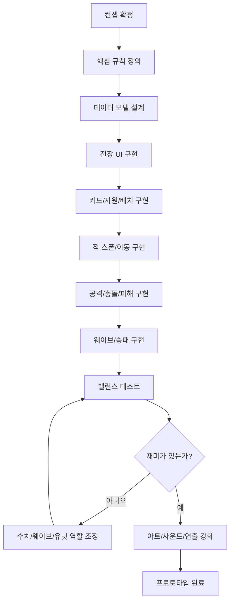
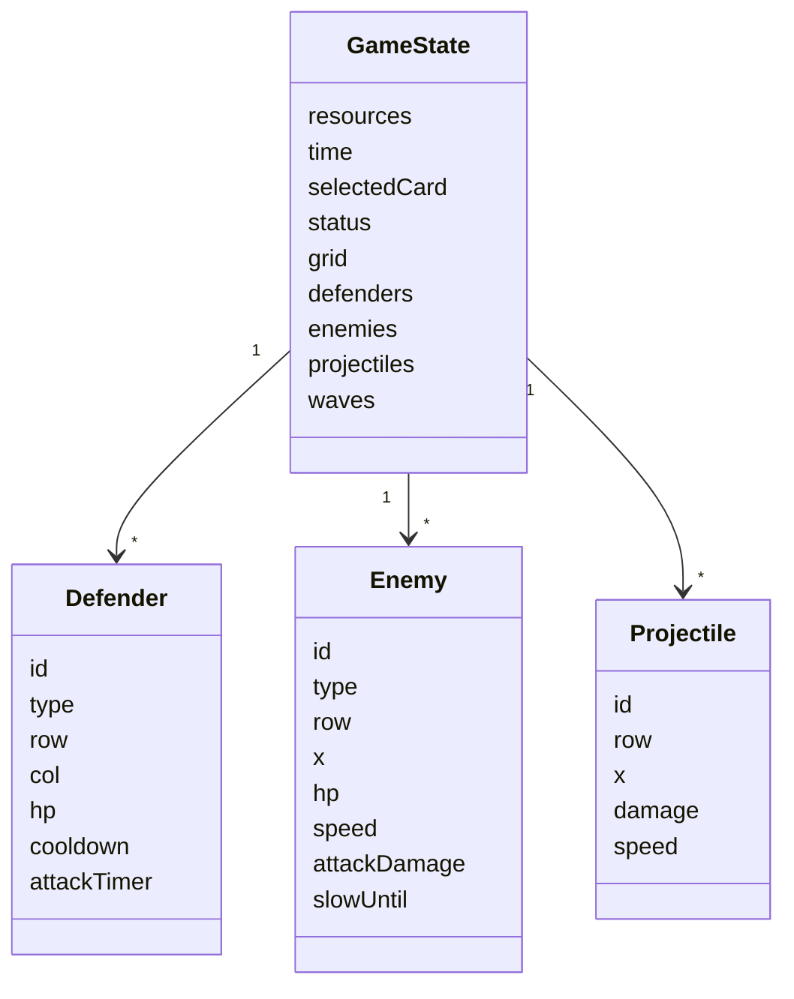
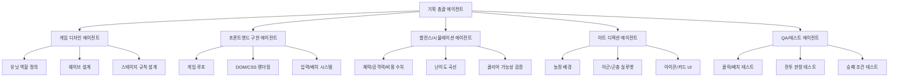

# 농부 vs 곤충 디펜스 게임 프로토타입 기술기획 대시보드

작성일: 2026-06-16  
프로젝트 위치: `바탕화면/웹 게임/디펜스게임`

## 0. 한 줄 목표

`Plants vs. Zombies`의 라인 디펜스 구조를 오마주하되, 캐릭터/세계관/시각 요소는 완전히 바꾼 `농부 vs 곤충` 웹 프로토타입을 만든다.

첫 프로토타입의 목표는 완성 게임이 아니라 `재미 검증 가능한 1스테이지`다.

---

## 1. 프로젝트 대시보드

| 구분 | 결정안 |
|---|---|
| 장르 | 웹 기반 라인 디펜스 |
| 테마 | 하미가 지키는 인생쌀집 농장 vs 곤충 침입 |
| 화면 | 5라인 x 9열 격자 전장 |
| 플랫폼 | PC 웹 우선, 이후 모바일 대응 |
| 기술 | HTML + CSS + JavaScript 또는 Vite 기반 Vanilla JS |
| 렌더링 | 1차는 DOM/CSS, 성능 문제 발생 시 Canvas 전환 |
| MVP 목표 | 배치, 자원, 적 이동, 공격, 충돌, 웨이브, 승패, 하미 HUD |
| 비목표 | 멀티플레이, 계정, 저장, 상점, 복잡한 애니메이션 |

---

## 1-1. 적군 확장 대시보드

초기 MVP는 곤충 4종만으로 게임 규칙을 검증한다. 이후 `프로토타입 0.2`부터 농작물 침입 동물과 공중 약탈자를 추가해 난이도와 웃긴 상황을 만든다.

| 단계 | 적군 범위 | 목적 |
|---|---|---|
| 0.1 | 진딧물, 애벌레, 메뚜기, 풍뎅이 | 기본 전투, 탱커, 고속, 장갑 규칙 검증 |
| 0.2 | 고라니, 멧돼지, 참새, 까치 | 지상 강적과 공중 적 추가 |
| 0.3 | 두더지, 들쥐, 오리, 까마귀 | 우회, 다수 러시, 전향/방해 기믹 |
| 0.4 | 왕멧돼지, 고라니 대장, 오리왕 | 보스와 스테이지별 개성 강화 |

### 적군 역할 매트릭스

| 이름 | 이동 | 핵심 능력 | 필요한 대응 |
|---|---|---|---|
| 진딧물 | 지상 | 약하지만 자주 등장 | 기본 공격 |
| 애벌레 | 지상 | 높은 체력 | 지속 화력 |
| 메뚜기 | 지상/점프 | 빠르게 접근 | 감속/즉발 피해 |
| 풍뎅이 | 지상 | 장갑 | 방어 관통/고화력 |
| 고라니 | 지상 | 낮은 방어물 뛰어넘기 | 높은 방벽/하미 스킬 |
| 멧돼지 | 지상 | 돌진, 방어물 큰 피해 | 튼튼한 방벽/폭발 |
| 참새 | 공중 | 작고 빠른 떼 | 대공 유닛 |
| 까치 | 공중 | 후방 자원 유닛 교란 | 대공/보호막 |
| 두더지 | 지하 | 일부 칸 우회 | 땅울림 덫 |
| 들쥐 | 지상 | 다수 러시, 창고 공격 | 광역 공격 |
| 오리 | 물길 | 논 스테이지 전용, 전향 가능 | 먹이 바구니/하미 스킬 |
| 까마귀 | 공중 | 자원 훔치기, 카드 방해 | 빠른 대공/스킬 |

### 오리 기믹

오리는 악역으로만 쓰지 않는다. 논 스테이지에서 처음에는 말썽을 부리지만, 특정 조건을 만족하면 아군 보조 유닛으로 바뀐다.

| 상태 | 행동 | 전환 조건 |
|---|---|---|
| 말썽 오리 | 물길을 따라 이동하며 배치를 흐트러뜨림 | 먹이 바구니 설치 또는 하미 스킬 사용 |
| 중립 오리 | 잠시 멈춰 주변 해충을 관찰 | 일정 시간 피해를 받지 않음 |
| 아군 오리 | 해충을 먹거나 느리게 만듦 | 전향 완료 |

---

## 2. 예상 기술적 병목

### 병목 요약

| 위험도 | 병목 | 왜 어려운가 | 대응 전략 |
|---|---|---|---|
| 높음 | 게임 루프와 상태 관리 | 유닛, 적, 투사체, 쿨타임, 웨이브가 동시에 변함 | 단일 `gameState`와 고정 tick 기반 업데이트 사용 |
| 높음 | 충돌/공격 판정 | 라인별 적 탐색, 투사체 충돌, 방어물 접촉 판정 필요 | 좌표계를 단순화하고 라인 단위로 계산 |
| 높음 | 밸런싱 | 비용, 체력, 공격속도, 웨이브 강도가 조금만 틀어져도 재미가 깨짐 | 모든 수치를 JSON/객체 데이터로 분리 |
| 중간 | DOM 성능 | 적/투사체가 많아지면 DOM 요소가 급증 | MVP는 DOM, 60개 이상 오브젝트부터 Canvas 검토 |
| 중간 | 카드 쿨타임 UX | 쿨타임/비용 부족/선택 상태를 명확히 보여줘야 함 | 카드 상태를 `ready`, `cooling`, `locked`로 분리 |
| 중간 | 모바일 대응 | 드래그/터치 배치가 PC 클릭과 다름 | 1차는 클릭 선택 후 칸 클릭, 드래그는 후순위 |
| 중간 | 아트 생산량 | 유닛/적/배경이 많으면 개발보다 그림이 병목 | 초반은 CSS/SVG 임시 아트, 이후 AI 이미지/스프라이트 교체 |
| 낮음 | 사운드 | 피드백에는 중요하지만 MVP 필수는 아님 | 효과음은 2차 마일스톤 |

### 가장 조심해야 할 3가지

1. 처음부터 Canvas나 엔진을 크게 잡으면 프로토타입 속도가 느려진다.
2. 유닛을 많이 만들기보다 `5개 아군 + 4개 적`만으로 재미를 검증해야 한다.
3. 밸런스 수치를 코드 곳곳에 박아두면 이후 수정이 지옥이 된다.

---

## 3. 권장 기술 스택

### 1차 프로토타입

| 영역 | 선택 |
|---|---|
| 빌드 | Vite 또는 순수 HTML |
| 언어 | JavaScript |
| UI | DOM + CSS Grid |
| 애니메이션 | CSS transition + requestAnimationFrame |
| 데이터 | JS 객체 또는 JSON |
| 저장 | localStorage는 후순위 |

### 추천안

초기에는 `순수 HTML/CSS/JS`가 가장 빠르다.

이유:

- 설치 없이 바로 실행 가능하다.
- 게임 구조를 빠르게 검증할 수 있다.
- 파일 수가 적어서 수정이 쉽다.
- 나중에 Vite/React/Canvas로 이전 가능하다.

단, 오브젝트 수가 많아지거나 애니메이션이 복잡해지면 Canvas로 전환한다.

---

## 3-1. 하미 브랜드 반영 방향

제공된 이미지 기준으로 하미는 `쌀알/씨앗형 3D 마스코트`, `분홍 볼`, `짧은 팔다리`, `운동/성장/응원` 이미지가 강하다. 따라서 프로토타입에서도 하미를 단순 장식이 아니라 플레이 경험의 중심으로 둔다.

| 위치 | 적용 방식 |
|---|---|
| 상단 HUD | 하미 얼굴 아이콘, 자원/스킬 게이지 표시 |
| 튜토리얼 | 하미 말풍선으로 짧게 안내 |
| 스킬 버튼 | 하미가 사용하는 특수 능력 1개 |
| 승리 화면 | 하미 성장/운동 포즈 연출 |
| 패배 화면 | 하미가 농장을 다시 지키자고 격려 |

MVP에서는 실제 3D 이미지를 바로 넣지 않아도 된다. 우선 CSS로 둥근 쌀알 캐릭터를 만들고, 이후 원본 하미 에셋을 받으면 교체한다.

---

## 4. MVP 범위

### 반드시 들어갈 기능

| 기능 | 설명 |
|---|---|
| 격자 전장 | 5라인 x 9열 |
| 카드 선택 | 상단 카드 클릭 |
| 자원 | 시간이 지나며 증가, 일부 유닛이 추가 생산 |
| 유닛 배치 | 선택한 카드로 빈 칸에 배치 |
| 쿨타임 | 카드별 재사용 시간 |
| 적 스폰 | 오른쪽에서 라인별 등장 |
| 적 이동 | 자기 라인에서 왼쪽 이동 |
| 자동 공격 | 공격 유닛이 같은 라인의 적 탐색 |
| 투사체 | 적에게 닿으면 피해 |
| 방어물 | 적을 멈추고 체력으로 버팀 |
| 웨이브 | 시간에 따라 적 증가 |
| 승패 | 모든 웨이브 방어 시 승리, 적이 왼쪽 끝 도달 시 패배 |

### MVP 유닛

| 타입 | 이름 | 역할 |
|---|---|---|
| 생산 | 퇴비통 | 일정 시간마다 자원 생성 |
| 공격 | 새총 허수아비 | 같은 라인 기본 원거리 공격 |
| 방어 | 호박 방벽 | 적을 막는 고체력 방어물 |
| 감속 | 끈끈이 판 | 밟은 적 이동속도 감소 |
| 즉발 | 고추 폭죽 | 한 라인 광역 피해 |

### MVP 적

| 타입 | 이름 | 역할 |
|---|---|---|
| 기본 | 진딧물 | 약하지만 자주 등장 |
| 탱커 | 애벌레 | 느리지만 체력 높음 |
| 고속 | 메뚜기 | 빠르게 접근 |
| 장갑 | 풍뎅이 | 방어력 높음 |

---

## 5. 단계별 구현 기획

### Phase 1. 뼈대 만들기

목표: 화면에 게임판과 카드 UI가 보이게 한다.

| 작업 | 산출물 | 완료 기준 |
|---|---|---|
| HTML 구조 작성 | `index.html` | 게임판, 카드바, HUD 표시 |
| CSS Grid 전장 | `style.css` | 5x9 칸이 안정적으로 렌더링 |
| 기본 데이터 정의 | `game.js` | 유닛/적/웨이브 데이터 객체 생성 |

### Phase 2. 배치와 자원

목표: 플레이어가 카드를 선택하고 칸에 유닛을 놓을 수 있게 한다.

| 작업 | 산출물 | 완료 기준 |
|---|---|---|
| 자원 시스템 | 자원 자동 증가 | 화면에 자원 수치 표시 |
| 카드 선택 | 선택 상태 UI | 선택한 카드가 강조됨 |
| 비용 체크 | 배치 제한 | 자원이 부족하면 배치 불가 |
| 쿨타임 | 카드 잠금 | 배치 후 일정 시간 비활성 |

### Phase 3. 적과 웨이브

목표: 곤충이 오른쪽에서 나오고 왼쪽으로 이동한다.

| 작업 | 산출물 | 완료 기준 |
|---|---|---|
| 적 생성 | 라인별 곤충 등장 | 웨이브 데이터에 따라 스폰 |
| 이동 로직 | 왼쪽 이동 | 적이 일정 속도로 이동 |
| 패배 조건 | 농가 도달 | 적이 왼쪽 끝 도달 시 게임오버 |

### Phase 4. 전투 시스템

목표: 유닛이 적을 공격하고 적이 방어물을 갉아먹는다.

| 작업 | 산출물 | 완료 기준 |
|---|---|---|
| 적 탐색 | 라인별 타겟팅 | 공격 유닛이 같은 라인의 가장 가까운 적을 찾음 |
| 투사체 | 발사체 생성 | 발사체가 오른쪽으로 이동 |
| 충돌 | 피해 처리 | 발사체와 적 접촉 시 체력 감소 |
| 접촉 전투 | 적 공격 | 적이 방어물 앞에서 멈추고 체력 감소시킴 |

### Phase 5. 재미 검증

목표: 한 스테이지를 처음부터 끝까지 플레이할 수 있게 한다.

| 작업 | 산출물 | 완료 기준 |
|---|---|---|
| 웨이브 1개 완성 | 3분 내외 스테이지 | 초중후반 압박이 있음 |
| 승리 조건 | 클리어 화면 | 모든 적 처치 시 승리 |
| 밸런스 조정 | 수치 조정 | 너무 쉽거나 불가능하지 않음 |
| 기본 피드백 | 타격/사망/쿨타임 표현 | 플레이 상황이 읽힘 |

### Phase 6. 컨셉 강화

목표: 원작과 분리되는 농장 게임의 인상을 만든다.

| 작업 | 산출물 | 완료 기준 |
|---|---|---|
| 농장 배경 | 흙밭/밭고랑 테마 | 원작 잔디밭 느낌을 피함 |
| 곤충 실루엣 | 적 구분 강화 | 진딧물/애벌레/메뚜기/풍뎅이가 한눈에 다름 |
| 유닛 아이콘 | 카드 가독성 | 역할이 카드만 봐도 이해됨 |
| 농부 스킬 1개 | 긴급 대응 | 위기 때 눌러서 쓸 수 있음 |

---

## 6. Workflow 차트



---

## 7. 게임 루프 구조


---

## 8. 상태 모델 초안



---

## 9. Subagents 구조 제안

Codex에서 실제로 여러 전문 역할로 나눠 작업한다고 가정하면 아래 구조가 좋다.



### 추천 역할 분담

| Agent | 담당 | 주요 산출물 |
|---|---|---|
| 기획 총괄 | 범위 관리, 결정 기록 | 마일스톤, 우선순위 |
| 게임 디자인 | 규칙, 유닛, 웨이브 | 유닛 데이터, 적 데이터 |
| 프론트엔드 구현 | 코드 작성 | HTML/CSS/JS |
| 밸런스 | 수치 조정 | 비용, 체력, 속도, 웨이브 |
| 아트 디렉션 | 비주얼 방향 | 색상, 캐릭터 실루엣, UI 톤 |
| QA | 깨지는 흐름 탐색 | 버그 목록, 체크리스트 |

---

## 10. 필요한 MCP / Skill 제안

현재 단계에서 필수 MCP는 없다. 다만 작업 단계에 따라 아래 도구가 유용하다.

| 단계 | 제안 | 용도 | 필요도 |
|---|---|---|---|
| 기획/문서 | 기본 Codex | 문서 작성, 구조화 | 높음 |
| 구현 | 기본 파일/쉘 도구 | HTML/CSS/JS 작성, 로컬 실행 | 높음 |
| 시각자료 | `imagegen` skill | 농장 배경, 곤충/유닛 컨셉 이미지 생성 | 중간 |
| 발표/공유 | Canva plugin | 기획안을 발표용 슬라이드로 변환 | 낮음 |
| 병렬 작업 | multi-agent tools | 기획/구현/QA를 역할별로 분리 | 중간 |

### 지금 당장 추천하는 선택

1. 구현은 기본 Codex 파일 편집으로 시작한다.
2. 임시 아트는 CSS와 간단한 형태로 만든다.
3. 첫 게임 루프가 완성된 뒤 `imagegen` skill로 배경/캐릭터 컨셉 이미지를 만든다.
4. 외부 공유가 필요할 때 Canva plugin으로 발표 자료를 만든다.

---

## 11. 파일 구조 제안

초기에는 단순한 구조가 좋다.

```text
디펜스게임/
  index.html
  src/
    style.css
    game.js
    data.js
  docs/
    01_pvz_analysis_and_farmers_vs_insects_concept.md
  프로토타입_기술기획_대시보드.md
```

### 파일 역할

| 파일 | 역할 |
|---|---|
| `index.html` | 게임 화면 구조 |
| `src/style.css` | 전장, 카드, HUD, 캐릭터 스타일 |
| `src/data.js` | 유닛/적/웨이브 수치 |
| `src/game.js` | 게임 루프, 입력, 전투 처리 |

---

## 12. 데이터 설계 초안

### 방어 유닛 데이터

```js
const defenderTypes = {
  compostBin: {
    name: "퇴비통",
    cost: 50,
    hp: 120,
    role: "producer",
    produceAmount: 25,
    produceInterval: 7000,
    cooldown: 5000
  },
  scarecrowSlinger: {
    name: "새총 허수아비",
    cost: 100,
    hp: 100,
    role: "shooter",
    damage: 20,
    attackInterval: 1500,
    cooldown: 5000
  }
};
```

### 적 데이터

```js
const enemyTypes = {
  aphid: {
    name: "진딧물",
    hp: 80,
    speed: 18,
    damage: 10,
    reward: 5
  },
  caterpillar: {
    name: "애벌레",
    hp: 220,
    speed: 9,
    damage: 18,
    reward: 10
  }
};
```

---

## 13. 테스트 체크리스트

| 구분 | 체크 |
|---|---|
| 배치 | 빈 칸에만 유닛이 놓이는가 |
| 비용 | 자원이 부족하면 배치가 막히는가 |
| 쿨타임 | 배치 후 카드가 잠기는가 |
| 스폰 | 웨이브 시간에 맞춰 적이 등장하는가 |
| 이동 | 적이 자기 라인에서만 움직이는가 |
| 공격 | 공격 유닛이 같은 라인의 적만 공격하는가 |
| 충돌 | 투사체가 적에게 닿으면 피해가 들어가는가 |
| 방어 | 적이 방어물 앞에서 멈추는가 |
| 사망 | 체력이 0 이하가 되면 제거되는가 |
| 패배 | 적이 왼쪽 끝에 도달하면 패배하는가 |
| 승리 | 모든 웨이브와 적을 처리하면 승리하는가 |

---

## 14. 개발 순서 추천

가장 빠른 순서:

1. `index.html`, `style.css`, `game.js`, `data.js` 생성
2. 5x9 전장 표시
3. 카드 UI 표시
4. 카드 선택 후 유닛 배치
5. 자원/비용/쿨타임 연결
6. 진딧물 1종 스폰과 이동
7. 새총 허수아비 공격 구현
8. 투사체 충돌 구현
9. 호박 방벽 접촉 전투 구현
10. 웨이브와 승패 구현
11. 나머지 유닛/적 추가
12. 밸런싱
13. 농장 테마 스타일 강화

---

## 15. 첫 구현 완료 기준

아래가 되면 `프로토타입 0.1`로 본다.

- 브라우저에서 게임 화면이 열린다.
- 플레이어가 카드를 선택하고 유닛을 배치할 수 있다.
- 자원이 줄고 시간이 지나며 증가한다.
- 곤충이 오른쪽에서 등장한다.
- 공격 유닛이 투사체를 발사한다.
- 곤충이 피해를 받고 죽는다.
- 방어 유닛이 곤충을 막는다.
- 한 스테이지에 승리/패배가 있다.

---

## 16. 다음 액션

다음 작업은 바로 `프로토타입 0.1 구현`이다.

권장 첫 커밋 범위:

```text
index.html
src/style.css
src/data.js
src/game.js
```

첫 구현에서는 예쁜 그림보다 `움직이는 규칙`이 우선이다. 화면이 투박해도 배치, 이동, 공격, 승패가 작동하면 성공이다.
